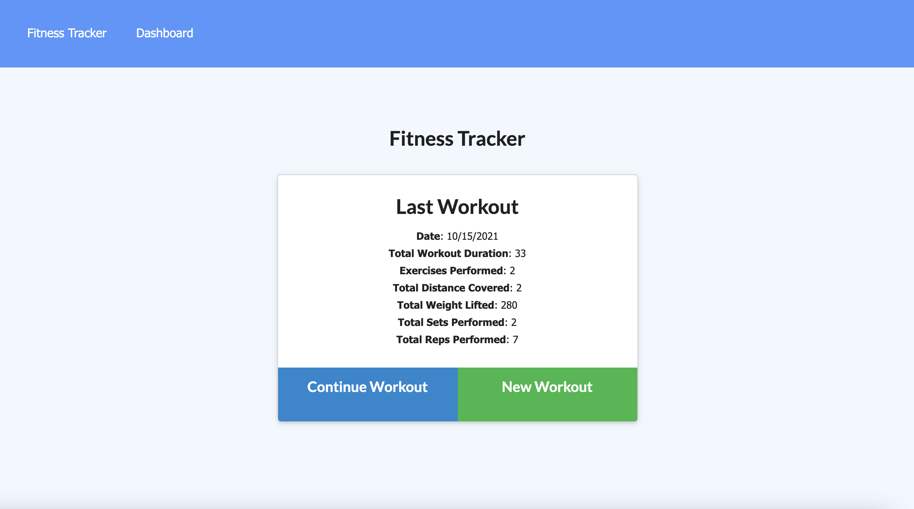
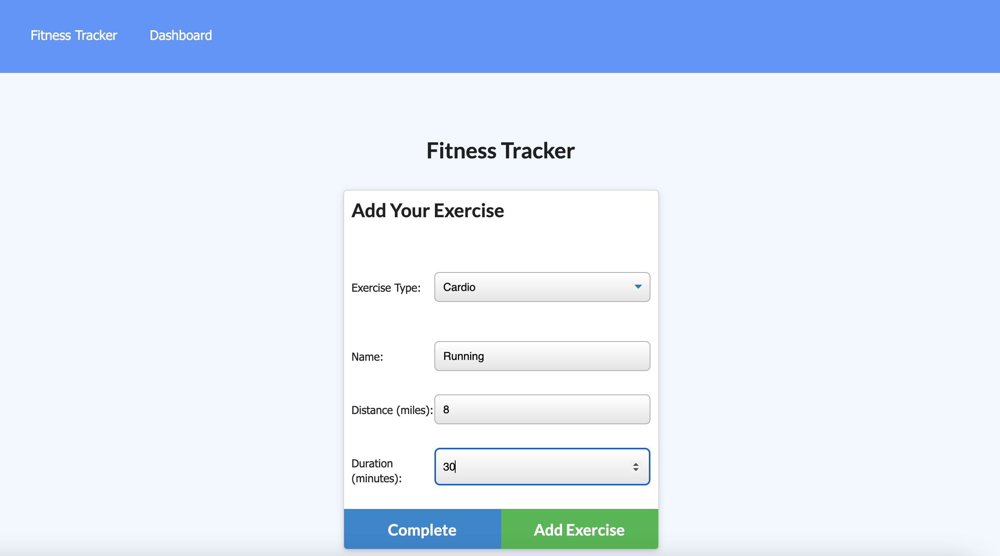
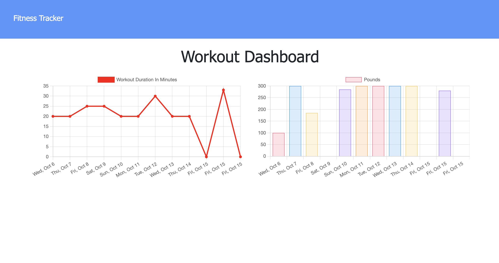

# Workout-Tracker

## Description :

A fullstack web application that uses MondoDB as its database and Mongoose npm package. The app uses node, express and MongoDB Atlas for database hosting.

## Table of Contents

[Installation](https://github.com/ilelandhayes/Workout-Tracker#Installation)

[Usage Of](https://github.com/ilelandhayes/Workout-Tracker#Usage-Of)

[How to Contribute](https://github.com/ilelandhayes/Workout-Tracker#How-to-Contribute)

[Screen Shots](https://github.com/ilelandhayes/Workout-Tracker#Screen-Shots)

[License](https://github.com/ilelandhayes/Workout-Tracker#License)

[Questions](https://github.com/ilelandhayes/Workout-Tracker#Questions)

## Technologies :

- MongoDB
- MongoDB Atlas
- Mongoose
- HTML
- CSS
- Javascript
- Chart.js

## Installation :

To use the application just run:

    'npm install'

in your terminal

## Usage Of :

Users can track their workouts, ranging from how many sets/reps are being done plus how much weight. All the saved workouts can be viewed on a chart to compare.

## Screen Shots :

## How to Contribute :

Any contributions are welcome!

## License :

This repository is released under the license of: [MIT](https://opensource.org/licenses/MIT)

## Questions :

If have any questions about this application feel free to contact me:

Github: [ilelandhayes](https://github.com/ilelandhayes)

Email: lelandkhayes13@gmail.com
